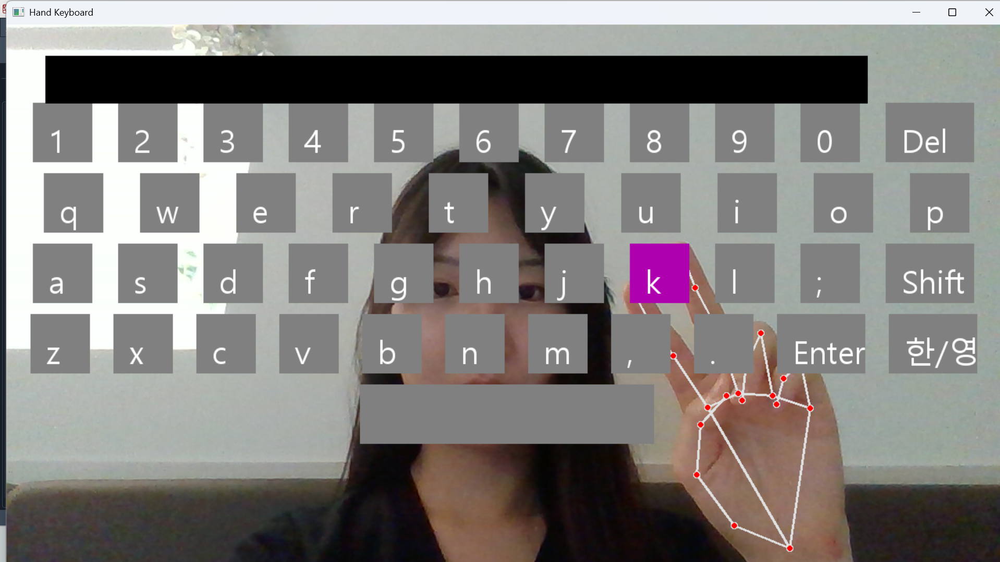
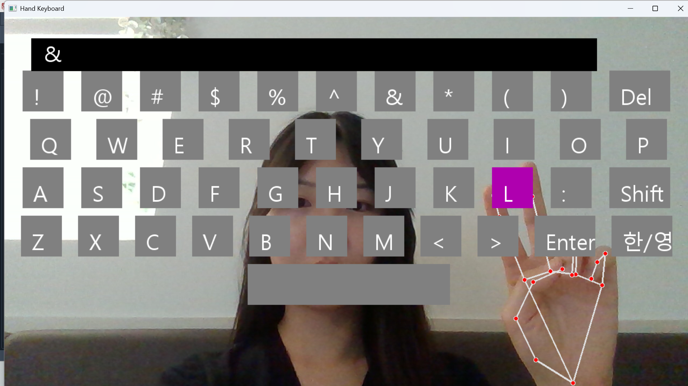
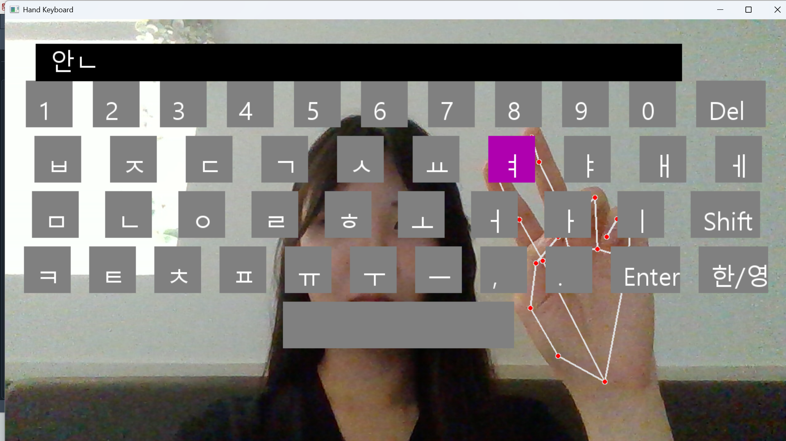
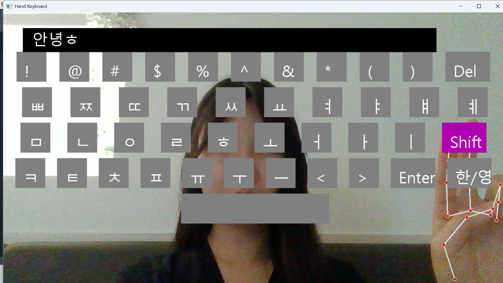
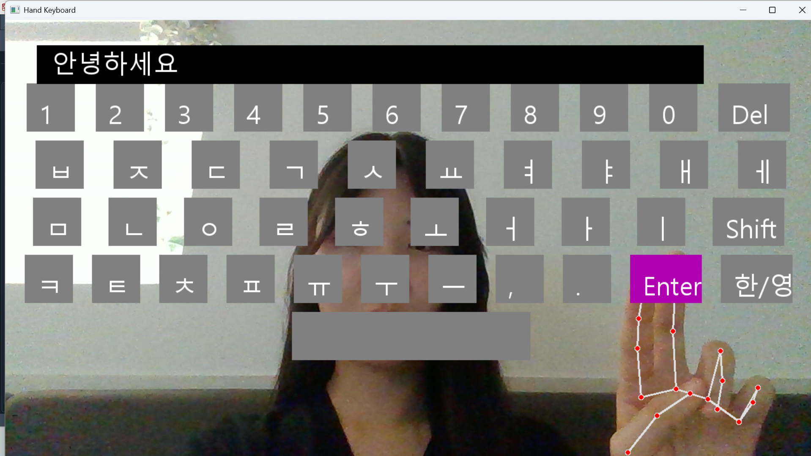
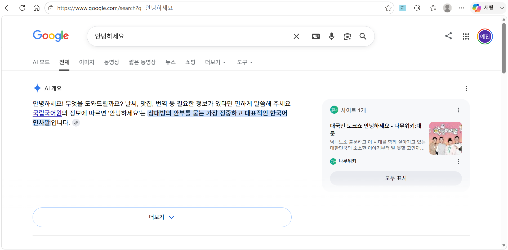

# Hand-Tracking-Virtual-Keyboard

## Overview

A real-time virtual keyboard implemented using OpenCV and MediaPipe. The system replicates the layout of a physical Korean/English keyboard and enables users to type by bringing their index finger and middle finger together. It also provides integrated web search functionality through the Enter key.

---

## Features

- Real-time hand tracking using MediaPipe
- Physical Korean/English keyboard layout
- Korean and English input support
- Hangul composition
- Shift mode for Korean and English keyboards
- Input by touching the index finger and middle finger together
- Integrated Google web search via the Enter key
- Delete and Space keys

---

## Tech Stack

- Python
- OpenCV
- MediaPipe
- NumPy
- Pillow
- Jamo

---

## Installation

```bash
pip install -r requirements.txt
python main.py
```

---

## Demo

### English Keyboard



### English Keyboard (Shift)



### Korean Keyboard



### Korean Keyboard (Shift)



### Before Web Search



### After Web Search



---

## Input Method

The virtual keyboard detects the user's hand in real time using MediaPipe. A key is selected by positioning the fingertip over it, and the key is entered by bringing the **index finger and middle finger together**, providing an intuitive touchless typing experience.

---

## Project Highlights

- Replicated the layout of a physical Korean/English keyboard.
- Implemented real-time hand tracking with OpenCV and MediaPipe.
- Supported Korean Hangul composition and English input.
- Implemented Shift mode for both Korean and English keyboards.
- Enabled Google web search directly through the Enter key.
- Designed a touchless typing interface based on finger gesture recognition.
